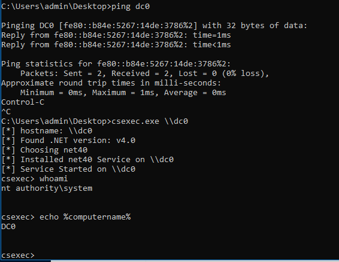

# CSExec (a c sharp psexec implementation)

This is an example for how to implement `psexec` (from SysInternals Suite) functionality, but in open source C#. This does not implement all of the psexec functionality, but it does implement the equivalent functionality to running: `psexec -s \\target-host cmd.exe`

`psexec` works by doing the following steps:

* copy a windows service executable (`psexecsvc.exe`) that is embedded within the `psexec.exe` binary to `\\target-host\admin$\system32`
* remotely connect to the service control manager on `\\target-host` to install and start the `psexecsvc.exe` service
* connect to the named pipe on the target host: `\\target-host\pipe\psexecsvc`
* send commands to the `psexecsvc` via the named pipe
* receive output via the `psexecsvc` named pipe
* upon exit, uninstall service, delete service executable

This project `csexec` mimicks those steps in native C# with only a minimal amount of `pinvoke` for the remote service installation. It's actually surprisingly simple and takes a very minimal amount of code to implement.

The primary difference between this and `psexec` is that it must determine the .NET runtime on the remote host in order to install the correctly compiled service executable.

Build in Visual Studio to create .NET 3.5, 4.0, and 4.5 executables for your client preference (Win 7 - Win 10+).
